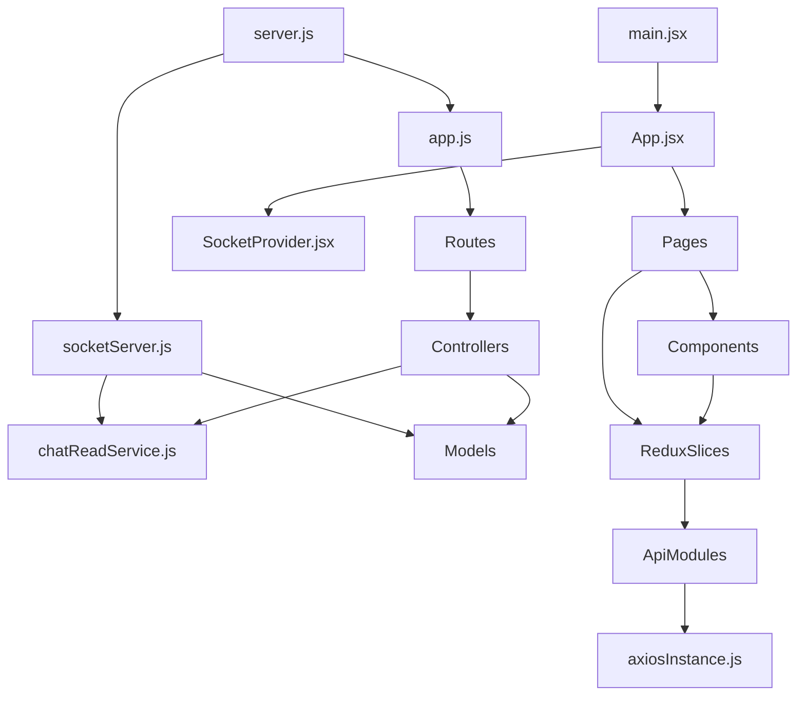
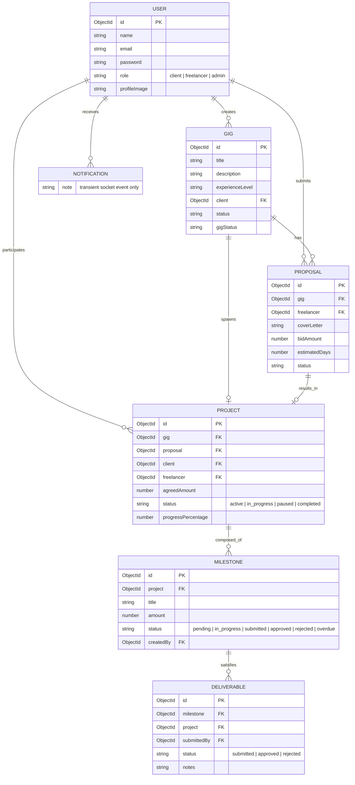
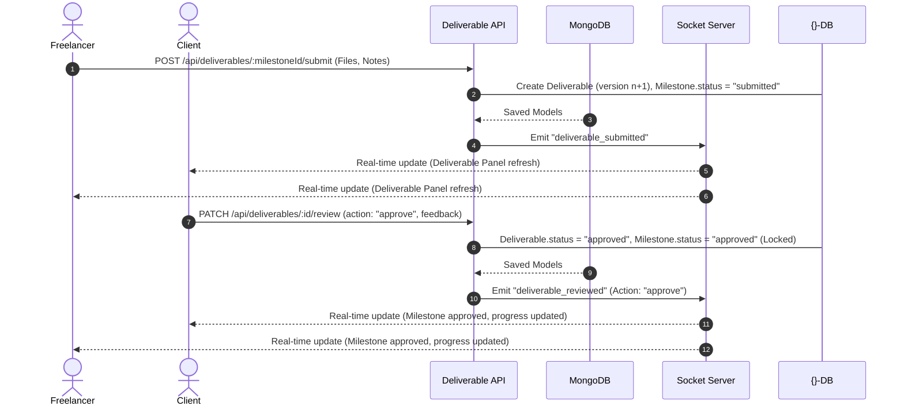

# SkillSphere - Deep Implementation Analysis: Review & Rating System

This document is the sole source of truth for implementing the Review & Rating System in SkillSphere. It extracts every implementation detail from both the backend (Express/Mongoose/Socket.io) and frontend (React/Redux/Tailwind) so that another AI can implement the entire system without opening a single project file.

---

## PHASE 1 - COMPLETE FILE INVENTORY

### Backend Files

#### `backend/src/server.js`
*   **Purpose:** Entry point of the backend server. Configures HTTP server, initializes database connection, and bootstraps Socket.io server.
*   **Imports:** `http`, `mongoose`, `dotenv`, `app` (app.js), `path`, `initializeSocket` (socketServer.js)
*   **Exports:** None (runs HTTP server)
*   **Used By:** Start script (`npm run start`, `npm run dev`)
*   **Depends On:** `backend/src/app.js`, `backend/src/socket/socketServer.js`

#### `backend/src/app.js`
*   **Purpose:** Initialises the Express application, applies global middlewares, registers HTTP routes, and attaches the global error handler.
*   **Imports:** `express`, `cors`, `helmet`, `cookie-parser`, `morgan`, `express-mongo-sanitize`, route files (auth, profile, gig, proposal, dashboard, project, milestone, task, deliverable, message), `errorHandler` (errorMiddleware.js)
*   **Exports:** `app` (Express application instance)
*   **Used By:** `backend/src/server.js`
*   **Depends On:** Route files and middleware files

#### `backend/src/models/user.models.js`
*   **Purpose:** Mongoose Schema for the User collection (Clients, Freelancers, Admins).
*   **Imports:** `mongoose`
*   **Exports:** `User` Model
*   **Used By:** Controllers (auth, dashboard, message, etc.)
*   **Depends On:** None

#### `backend/src/models/FreelancerProfile.models.js`
*   **Purpose:** Mongoose Schema for Freelancer-specific profiles. Contains skills, portfolio, experience, completion score.
*   **Imports:** `mongoose`
*   **Exports:** `FreelancerProfile` Model
*   **Used By:** `profileController.js`, `authController.js` (implicit)
*   **Depends On:** `user.models.js` (User ref)

#### `backend/src/models/Gig.models.js`
*   **Purpose:** Mongoose Schema for Gigs (job postings) created by Clients.
*   **Imports:** `mongoose`
*   **Exports:** `Gig` Model
*   **Used By:** Controllers (gig, proposal, dashboard, project)
*   **Depends On:** `user.models.js`, `Proposal.models.js`

#### `backend/src/models/Proposal.models.js`
*   **Purpose:** Mongoose Schema for Freelancer applications on Gigs.
*   **Imports:** `mongoose`
*   **Exports:** `Proposal` Model
*   **Used By:** Controllers (proposal, gig, dashboard, project, message)
*   **Depends On:** `Gig.models.js`, `user.models.js`, `Project.models.js`

#### `backend/src/models/Project.models.js`
*   **Purpose:** Mongoose Schema for contracts/workspaces spawned after a proposal is accepted.
*   **Imports:** `mongoose`
*   **Exports:** `Project` Model
*   **Used By:** Controllers (project, milestone, deliverable, dashboard)
*   **Depends On:** `Gig.models.js`, `Proposal.models.js`, `user.models.js`

#### `backend/src/models/Milestone.js`
*   **Purpose:** Mongoose Schema for payment and progress milestones within a Project.
*   **Imports:** `mongoose`
*   **Exports:** `Milestone` Model
*   **Used By:** Controllers (milestone, deliverable, project, dashboard)
*   **Depends On:** `Project.models.js`, `user.models.js`

#### `backend/src/models/Deliverable.js`
*   **Purpose:** Mongoose Schema for freelancer files submitted under milestones for review.
*   **Imports:** `mongoose`
*   **Exports:** `Deliverable` Model
*   **Used By:** `deliverableController.js`
*   **Depends On:** `Milestone.js`, `Project.models.js`, `user.models.js`

#### `backend/src/models/Conversation.js`
*   **Purpose:** Mongoose Schema for direct chats between client and freelancer mapped to a Proposal or Project.
*   **Imports:** `mongoose`
*   **Exports:** `Conversation` Model
*   **Used By:** Controllers (message, project, socketServer)
*   **Depends On:** `user.models.js`, `Proposal.models.js`, `Gig.models.js`, `Project.models.js`, `Message.js`

#### `backend/src/models/Message.js`
*   **Purpose:** Mongoose Schema for individual chat messages.
*   **Imports:** `mongoose`
*   **Exports:** `Message` Model
*   **Used By:** Controllers (message, socketServer)
*   **Depends On:** `Conversation.js`, `user.models.js`

#### `backend/src/socket/socketServer.js`
*   **Purpose:** Implements the Socket.io WebSocket server, handles connection events, room joining, typing statuses, realtime message deliveries, message read receipts, and user online tracking.
*   **Imports:** `socket.io` (Server), `jsonwebtoken`, `mongoose`, Models (User, Conversation, Message), `messagePayload` utils, `chatReadService` services
*   **Exports:** `initializeSocket` function
*   **Used By:** `backend/src/server.js`
*   **Depends On:** Models, services (`chatReadService.js`), utils (`messagePayload.js`)

#### `backend/src/services/chatReadService.js`
*   **Purpose:** Helper queries to compute unread chat messages, build conversation structures, and manage read receipts.
*   **Imports:** Models (Message, Conversation)
*   **Exports:** Helper methods (`buildConversationReadState`, `buildMessagePayload`, `chatRoom`, `getFirstUnreadMessage`, `getUnreadCount`, `isParticipant`, `markMessagesRead`, `userRoom`)
*   **Used By:** `socketServer.js`, controllers (`messageController.js`, `projectController.js`)
*   **Depends On:** Models (Message, Conversation)

#### `backend/src/controllers/projectController.js`
*   **Purpose:** Express controller handlers for fetching, detail viewing, and patching project parameters (such as updating contract status to completed/paused/active).
*   **Imports:** Models (Project, Conversation, Gig, Milestone), `milestoneController` helpers, `asynchandler`, `chatReadService`
*   **Exports:** Controller methods (`getUserProjects`, `getProjectById`, `updateProject`)
*   **Used By:** `projectRoutes.js`
*   **Depends On:** Models, services, controllers

#### `backend/src/controllers/deliverableController.js`
*   **Purpose:** Express controller handlers for submitting, retrieving, and reviewing (approving/rejecting) deliverables.
*   **Imports:** Models (Deliverable, Milestone, Project), `asynchandler`, `apiResponse` helpers, `milestoneController` helpers
*   **Exports:** Controller methods (`submitDeliverables`, `getDeliverables`, `getDeliverableById`, `reviewDeliverable`)
*   **Used By:** `deliverableRoutes.js`
*   **Depends On:** Models, helper functions

#### `backend/src/controllers/milestoneController.js`
*   **Purpose:** Express controller handlers for creating, editing, deleting, status-updating milestones, and querying upcoming tasks.
*   **Imports:** Models (Project, Milestone), `asynchandler`
*   **Exports:** Controller methods (`createMilestone`, `getProjectMilestones`, `updateMilestone`, `deleteMilestone`, `updateMilestoneStatus`, `checkAndUpdateOverdueMilestones`, `enrichMilestone`, `getUpcomingTasks`)
*   **Used By:** `milestoneRoutes.js`, `taskRoutes.js`, controllers (`projectController.js`, `deliverableController.js`, `dashboardController.js`)
*   **Depends On:** Models

#### `backend/src/controllers/dashboardController.js`
*   **Purpose:** Generates metadata summary statistics, attention items, and active counts for client, freelancer, and admin dashboards.
*   **Imports:** Models (Gig, Proposal, Project, User, Milestone), `milestoneController` helpers, `asynchandler`
*   **Exports:** Controller methods (`getClientDashboard`, `getFreelancerDashboard`, `getAdminDashboard`)
*   **Used By:** `dashboardRoutes.js`
*   **Depends On:** Models, controllers

#### `backend/src/controllers/profileController.js`
*   **Purpose:** Express controller handlers for fetching profiles, updating fields, uploading assets, and adding portfolio or experience records.
*   **Imports:** Model (`FreelancerProfile`), `asynchandler`
*   **Exports:** Controller methods (`getMyProfile`, `getProfileByUserId`, `createOrUpdateProfile`, `uploadProfileImageHandler`, `uploadResumeHandler`, `addPortfolioItem`, `removePortfolioItem`)
*   **Used By:** `profileRoutes.js`
*   **Depends On:** Models

---

### Frontend Files

#### `frontend/src/App.jsx`
*   **Purpose:** React Router configuration. Outlines public layouts, authenticated guards, allowed role routes, and nested router structures.
*   **Imports:** `react-router-dom` elements, React Redux dispatchers/selectors, thunks (`loadUser` from `authSlice`), storage helper (`getAccessToken`), layout components, route page containers, `SocketProvider`
*   **Exports:** `App` Component
*   **Used By:** `frontend/src/main.jsx`
*   **Depends On:** Slices, components, route guards

#### `frontend/src/components/shared/SocketProvider.jsx`
*   **Purpose:** Provides a Socket.io WebSocket client context to listen for realtime events and dispatch updates to the Redux store.
*   **Imports:** React hooks, Redux hooks, `socketService` connector, message slices, milestone slices, project slices, deliverable slices
*   **Exports:** `SocketContext` context, `SocketProvider` Component
*   **Used By:** `frontend/src/App.jsx`
*   **Depends On:** Socket services, Redux slices

#### `frontend/src/redux/store.js`
*   **Purpose:** Configures and exports the Redux store combining all slices.
*   **Imports:** `@reduxjs/toolkit` (`configureStore`), Redux slices (auth, profile, project, message, milestone, deliverable)
*   **Exports:** Redux store instance
*   **Used By:** `frontend/src/main.jsx`
*   **Depends On:** Slices

#### `frontend/src/redux/slices/projectSlice.js`
*   **Purpose:** Manages the project state in Redux. Exposes async thunks for fetching and updating projects.
*   **Imports:** Redux toolkit elements, `projectApi` methods
*   **Exports:** Actions, thunks (`fetchUserProjects`, `fetchProjectById`, `updateProjectDetails`), Reducer
*   **Used By:** `ProjectWorkspace.jsx`, `MyProjectsPage.jsx`, components, `SocketProvider.jsx`
*   **Depends On:** `projectApi.js`

#### `frontend/src/redux/slices/deliverableSlice.js`
*   **Purpose:** Manages the deliverable state in Redux. Exposes async thunks for submissions and approvals/rejections.
*   **Imports:** Redux toolkit elements, `deliverableApi` methods
*   **Exports:** Actions, thunks (`submitNewDeliverables`, `fetchDeliverables`, `fetchDeliverableById`, `reviewExistingDeliverable`), Reducer
*   **Used By:** `DeliverableReviewPanel.jsx`, `DeliverableSubmissionModal.jsx`
*   **Depends On:** `deliverableApi.js`

#### `frontend/src/pages/projects/ProjectWorkspace.jsx`
*   **Purpose:** Dual-panel contract workspace: Left shows overview, deadlines, milestones, progress bar; Right attaches chat interface.
*   **Imports:** React hooks, react-router parameters, Redux hooks, icons, slice thunks (`fetchProjectById`, `updateProjectDetails`, `resetProjectState`), UI components (`StatusBadge`, `ChatWindow`, `LoadingSpinner`, `Button`, `MilestonePanel`)
*   **Exports:** `ProjectWorkspace` Component
*   **Used By:** `App.jsx`
*   **Depends On:** Redux slices, components

#### `frontend/src/pages/profile/ProfilePage.jsx`
*   **Purpose:** Visualizes freelancer identity: hourly rate, availability status, skills tags, bio text, experience list, portfolio cards, and completion score.
*   **Imports:** React hooks, Redux hooks, react-router links, icons, thunk (`fetchMyProfile`), helper panels (`ProfileCompletionBar`, `SkillTag`, `PortfolioCard`, `ExperienceCard`, `LoadingSpinner`, `Button`)
*   **Exports:** `ProfilePage` Component
*   **Used By:** `App.jsx`
*   **Depends On:** Redux profile slice, visual helper cards

#### `frontend/src/components/proposals/ProposalCard.jsx`
*   **Purpose:** Cards displaying cover letter details, proposed amounts, timelines, and status badges.
*   **Imports:** `BudgetRange` helper, `StatusBadge` helper
*   **Exports:** `ProposalCard` Component
*   **Used By:** `GigProposalsPage.jsx`, `MyProposalsPage.jsx`
*   **Depends On:** None

---

### Dependency Mapping



---

## PHASE 2 - COMPLETE ROUTE MAPPING

All backend routes are prefix-mapped in `backend/src/app.js` and secured by JWT verification middleware (`protect`).

| HTTP Method | Route Path | Controller Function | Middleware | Auth | Role Restrictions | Request Body Shape | Query Params | Response Shape |
| :--- | :--- | :--- | :--- | :--- | :--- | :--- | :--- | :--- |
| **POST** | `/api/auth/register` | `registerUser` | `validateRequest` | Public | None | `{ name, email, password, role, secretCode? }` | None | `{ success: true, message: string, data: { accessToken, refreshToken, user } }` |
| **POST** | `/api/auth/login` | `loginUser` | `validateRequest` | Public | None | `{ email, password }` | None | `{ success: true, message: string, data: { accessToken, refreshToken, user } }` |
| **GET** | `/api/auth/me` | `getMe` | `protect` | Required | Any | None | None | `{ success: true, data: { user: { _id, name, email, role } } }` |
| **POST** | `/api/auth/refresh` | `refreshAuthTokens` | `validateRequest` | Public | None | `{ refreshToken }` | None | `{ success: true, data: { accessToken, refreshToken, user } }` |
| **GET** | `/api/dashboard/client` | `getClientDashboard` | `protect`, `authorizeRoles("client")` | Required | Client | None | None | `{ success: true, data: { totalGigsPosted, openGigs, closedGigs, totalProposalsReceived, acceptedProposals, pendingProposals, activeProjects, completedProjects, milestonesDueToday, overdueMilestones, pendingApprovals, atRiskProjects, needsAttention: Array } }` |
| **GET** | `/api/dashboard/freelancer` | `getFreelancerDashboard` | `protect`, `authorizeRoles("freelancer")` | Required | Freelancer | None | None | `{ success: true, data: { totalProposalsSent, acceptedProposals, rejectedProposals, pendingProposals, activeProjects, completedProjects, upcomingDeadlines, tasksThisWeek, overdueTasks, awaitingApproval } }` |
| **GET** | `/api/profile/me` | `getMyProfile` | `protect`, `authorizeRoles("freelancer")` | Required | Freelancer | None | None | `{ success: true, data: { profile: FreelancerProfile } }` |
| **PUT** | `/api/profile` | `createOrUpdateProfile` | `protect`, `authorizeRoles("freelancer")` | Required | Freelancer | `{ title, bio, skills, hourlyRate, availability, location, experience }` | None | `{ success: true, message: string, data: { profile: FreelancerProfile } }` |
| **GET** | `/api/profile/user/:userId` | `getProfileByUserId` | None | Public | None | None | None | `{ success: true, data: { profile: FreelancerProfile } }` |
| **POST** | `/api/gigs` | `createGig` | `protect`, `authorizeRoles("client")`, `gigFields`, `validateRequest` | Required | Client | `{ title, description, skillsRequired, budgetMin, budgetMax, location, experienceLevel }` | None | `{ success: true, message: string, data: { gig } }` |
| **GET** | `/api/gigs` | `getGigs` | `listFilters`, `validateRequest` | Public | None | None | `page, limit, minBudget, maxBudget, experienceLevel` | `{ success: true, data: { gigs, totalPages, currentPage } }` |
| **GET** | `/api/gigs/my` | `getMyGigs` | `protect`, `authorizeRoles("client")` | Required | Client | None | `page, limit` | `{ success: true, data: { gigs, totalPages, currentPage } }` |
| **GET** | `/api/gigs/:id` | `getGigById` | `validateRequest` | Public | None | None | None | `{ success: true, data: { gig } }` |
| **POST** | `/api/proposals` | `createProposal` | `protect`, `authorizeRoles("freelancer")`, `validateRequest` | Required | Freelancer | `{ gig, coverLetter, bidAmount, estimatedDays }` | None | `{ success: true, message: string, data: { proposal } }` |
| **GET** | `/api/proposals/my` | `getMyProposals` | `protect`, `authorizeRoles("freelancer")` | Required | Freelancer | None | None | `{ success: true, data: { proposals } }` |
| **GET** | `/api/proposals/gig/:gigId` | `getGigProposals` | `protect`, `authorizeRoles("client")`, `validateRequest` | Required | Client | None | None | `{ success: true, data: { gig, proposals } }` |
| **PATCH** | `/api/proposals/:id/status` | `updateProposalStatus` | `protect`, `authorizeRoles("client")`, `validateRequest` | Required | Client | `{ status: "accepted"/"rejected" }` | None | `{ success: true, data: { proposal, project } }` |
| **GET** | `/api/projects` | `getUserProjects` | `protect` | Required | Any Member | None | None | `{ success: true, data: { projects } }` |
| **GET** | `/api/projects/:id` | `getProjectById` | `protect` | Required | Client/Freelancer | None | None | `{ success: true, data: { project, conversation } }` |
| **PATCH** | `/api/projects/:id` | `updateProject` | `protect` | Required | Client/Freelancer | Client: `{ status, expectedCompletionDate }`, Freelancer: `{ status: "in_progress"/"revision" }` | None | `{ success: true, message: string, data: { project } }` |
| **POST** | `/api/milestones` | `createMilestone` | `protect` | Required | Client Only | `{ projectId, title, description, amount, dueDate, priority }` | None | `{ success: true, message: string, data: { milestone } }` |
| **GET** | `/api/milestones/project/:projectId` | `getProjectMilestones` | `protect` | Required | Client/Freelancer | None | None | `{ success: true, data: { milestones, budgetInfo } }` |
| **PATCH** | `/api/milestones/:id/status` | `updateMilestoneStatus` | `protect` | Required | Client/Freelancer | Freelancer: `{ status: "in_progress"/"submitted" }`, Client: `{ status: "approved" }` | None | `{ success: true, message: string, data: { milestone } }` |
| **POST** | `/api/deliverables/:milestoneId/submit` | `submitDeliverables` | `protect`, `uploadDeliverables` | Required | Freelancer | Multi-part Form: `{ notes, files[] }` | None | `{ success: true, data: { deliverable, milestone }, message: string }` |
| **PATCH** | `/api/deliverables/:deliverableId/review` | `reviewDeliverable` | `protect` | Required | Client | `{ action: "approve"/"reject", feedback }` | None | `{ success: true, data: { deliverable, milestone }, message: string }` |
| **GET** | `/api/tasks/upcoming` | `getUpcomingTasks` | `protect` | Required | Client/Freelancer | None | `status, priority, project, search, dueDate, sortBy, sortOrder, page, limit, grouped` | `{ success: true, data: { tasks, pagination } }` or `{ success: true, data: { grouped } }` |

---

## PHASE 3 - COMPLETE FRONTEND ROUTE MAPPING

| Route | Component | Protected? | Role Restrictions | API Calls | Redux Dependencies | Socket Dependencies |
| :--- | :--- | :--- | :--- | :--- | :--- | :--- |
| `/login` | `LoginPage` | No | None | `POST /api/auth/login` | `authSlice` | None |
| `/register` | `RegisterPage` | No | None | `POST /api/auth/register` | `authSlice` | None |
| `/dashboard` | `DashboardPage` | Yes | None | Redirects to role-specific dashboard views | `authSlice` | None |
| `/dashboard/freelancer` | `FreelancerDashboard` | Yes | `freelancer` | `GET /api/dashboard/freelancer` | `authSlice` | `project_progress_updated`, `milestone_status_changed`, `deliverable_reviewed`, `unread_count_updated` |
| `/dashboard/client` | `ClientDashboard` | Yes | `client` | `GET /api/dashboard/client` | `authSlice` | `project_progress_updated`, `milestone_status_changed`, `deliverable_submitted`, `unread_count_updated` |
| `/dashboard/profile` | `ProfilePage` | Yes | `freelancer` | `GET /api/profile/me` | `profileSlice` | None |
| `/dashboard/profile/edit` | `EditProfilePage` | Yes | `freelancer` | `PUT /api/profile`, image/resume upload | `profileSlice` | None |
| `/dashboard/gigs` | `GigListPage` | Yes | None | `GET /api/gigs` | `authSlice` | None |
| `/dashboard/gigs/:gigId` | `GigDetailPage` | Yes | None | `GET /api/gigs/:id`, `POST /api/proposals` | `authSlice` | None |
| `/dashboard/gigs/create` | `CreateGigPage` | Yes | `client` | `POST /api/gigs` | `authSlice` | None |
| `/dashboard/gigs/my` | `MyGigsPage` | Yes | `client` | `GET /api/gigs/my` | `authSlice` | None |
| `/dashboard/gigs/:gigId/proposals` | `GigProposalsPage` | Yes | `client` | `GET /api/proposals/gig/:gigId`, `PATCH /api/proposals/:id/status`, `POST /api/conversations/create` | `messageSlice` | None |
| `/dashboard/proposals` | `MyProposalsPage` | Yes | `freelancer` | `GET /api/proposals/my` | `authSlice` | None |
| `/dashboard/tasks` | `TasksPage` | Yes | `freelancer` | `GET /api/tasks/upcoming` | `authSlice` | `milestone_status_changed`, `milestone_overdue` |
| `/dashboard/my-projects` | `MyProjectsPage` | Yes | None | `GET /api/projects` | `projectSlice` | `project_updated` |
| `/dashboard/my-projects/:projectId` | `ProjectWorkspace` | Yes | Client/Freelancer member | `GET /api/projects/:id`, `PATCH /api/projects/:id` | `projectSlice`, `messageSlice`, `milestoneSlice`, `deliverableSlice` | `chat_updated`, `new_message`, `messages_read`, `project_progress_updated`, `milestone_status_changed`, `deliverable_submitted`, `deliverable_reviewed`, `milestone_created`, `milestone_updated`, `milestone_deleted` |
| `/dashboard/messages` | `MessagesPage` | Yes | None | `GET /api/conversations`, `GET /api/messages/:id` | `messageSlice` | `new_message`, `messages_read`, `typing_status`, `user_online_status`, `online-users` |

---

## PHASE 4 - MODEL EXTRACTION

### 1. User (`backend/src/models/user.models.js`)
*   **Schema Details:**
    *   `name`: `{ type: String, required: true, trim: true }`
    *   `email`: `{ type: String, required: true, unique: true, lowercase: true }`
    *   `password`: `{ type: String, required: true }`
    *   `role`: `{ type: String, enum: ["client", "freelancer", "admin"], default: "client" }`
    *   `profileImage`: `{ type: String, default: "" }`
    *   `timestamps`: `{ createdAt: true, updatedAt: true }` (Automatic MongoDB fields)
*   **Indexes:** `email: 1` (Implicitly created by `unique: true`)
*   **Virtuals:** None
*   **Methods:** None
*   **Middleware:** None
*   **Relationships:**
    *   Referenced by: `FreelancerProfile` (`user` ObjectId), `Gig` (`client` ObjectId), `Proposal` (`freelancer` ObjectId), `Project` (`client`/`freelancer` ObjectId), `Milestone` (`createdBy` ObjectId), `Deliverable` (`submittedBy`/`reviewedBy` ObjectId), `Conversation` (`participants` array), `Message` (`sender` ObjectId).

### 2. Gig (`backend/src/models/Gig.models.js`)
*   **Schema Details:**
    *   `title`: `{ type: String, required: true, trim: true }`
    *   `description`: `{ type: String, required: true, trim: true }`
    *   `skillsRequired`: `[{ type: String }]`
    *   `budgetMin`: `{ type: Number, required: true, min: 0 }`
    *   `budgetMax`: `{ type: Number, required: true, min: 0 }`
    *   `location`: `{ type: String, trim: true, default: "" }`
    *   `experienceLevel`: `{ type: String, enum: ["entry", "intermediate", "expert"], required: true }`
    *   `client`: `{ type: mongoose.Schema.Types.ObjectId, ref: "User", required: true }`
    *   `status`: `{ type: String, enum: ["open", "closed"], default: "open" }`
    *   `hiredProposal`: `{ type: mongoose.Schema.Types.ObjectId, ref: "Proposal", default: null }`
    *   `hiredFreelancer`: `{ type: mongoose.Schema.Types.ObjectId, ref: "User", default: null }`
    *   `hiredAt`: `{ type: Date, default: null }`
    *   `gigStatus`: `{ type: String, enum: ["draft", "open", "in_progress", "completed", "closed"], default: "open" }`
    *   `activeFreelancers`: `[{ type: mongoose.Schema.Types.ObjectId, ref: "User" }]`
    *   `timestamps`: `{ createdAt: true, updatedAt: false }`
*   **Indexes:** None
*   **Virtuals:** None
*   **Methods:** None
*   **Middleware:** None
*   **Relationships:**
    *   Belongs to: `User` (client)
    *   Has many: `Proposal`
    *   Has one: `Project`

### 3. Proposal (`backend/src/models/Proposal.models.js`)
*   **Schema Details:**
    *   `gig`: `{ type: mongoose.Schema.Types.ObjectId, ref: "Gig", required: true }`
    *   `freelancer`: `{ type: mongoose.Schema.Types.ObjectId, ref: "User", required: true }`
    *   `coverLetter`: `{ type: String, required: true, trim: true }`
    *   `bidAmount`: `{ type: Number, required: true, min: 0 }`
    *   `estimatedDays`: `{ type: Number, required: true, min: 1 }`
    *   `status`: `{ type: String, enum: ["submitted", "shortlisted", "accepted", "rejected", "withdrawn", "hired", "completed"], default: "submitted" }`
    *   `shortlistedAt`: `{ type: Date, default: null }`
    *   `acceptedAt`: `{ type: Date, default: null }`
    *   `rejectedAt`: `{ type: Date, default: null }`
    *   `withdrawnAt`: `{ type: Date, default: null }`
    *   `hiredAt`: `{ type: Date, default: null }`
    *   `project`: `{ type: mongoose.Schema.Types.ObjectId, ref: "Project", default: null }`
    *   `timestamps`: `{ createdAt: true, updatedAt: false }`
*   **Indexes:**
    *   `{ gig: 1, freelancer: 1 }` (Compound index, unique constraint)
*   **Virtuals:** None
*   **Methods:** None
*   **Middleware:** None
*   **Relationships:**
    *   Belongs to: `Gig`, `User` (freelancer)
    *   Links to: `Project`

### 4. Project (`backend/src/models/Project.models.js`)
*   **Schema Details:**
    *   `gig`: `{ type: mongoose.Schema.Types.ObjectId, ref: "Gig", required: true, unique: true }`
    *   `proposal`: `{ type: mongoose.Schema.Types.ObjectId, ref: "Proposal", required: true, unique: true }`
    *   `client`: `{ type: mongoose.Schema.Types.ObjectId, ref: "User", required: true }`
    *   `freelancer`: `{ type: mongoose.Schema.Types.ObjectId, ref: "User", required: true }`
    *   `agreedAmount`: `{ type: Number, required: true, min: 0 }`
    *   `estimatedDays`: `{ type: Number, required: true, min: 1 }`
    *   `status`: `{ type: String, enum: ["active", "in_progress", "revision", "paused", "completed", "cancelled"], default: "active" }`
    *   `progressPercentage`: `{ type: Number, default: 0, min: 0, max: 100 }`
    *   `expectedCompletionDate`: `{ type: Date, default: null }`
    *   `startedAt`: `{ type: Date, default: Date.now }`
    *   `completedAt`: `{ type: Date, default: null }`
    *   `timestamps`: `{ createdAt: true, updatedAt: true }`
*   **Indexes:**
    *   `{ client: 1, status: 1 }`
    *   `{ freelancer: 1, status: 1 }`
*   **Virtuals:** None
*   **Methods:** None
*   **Middleware:** None
*   **Relationships:**
    *   Belongs to: `Gig`, `Proposal`, `User` (client), `User` (freelancer)
    *   Has many: `Milestone`, `Deliverable`

### 5. Milestone (`backend/src/models/Milestone.js`)
*   **Schema Details:**
    *   `project`: `{ type: mongoose.Schema.Types.ObjectId, ref: "Project", required: true }`
    *   `title`: `{ type: String, required: true, trim: true, minlength: 3 }`
    *   `description`: `{ type: String, default: "", trim: true }`
    *   `amount`: `{ type: Number, required: true, min: 0 }`
    *   `dueDate`: `{ type: Date, default: null }`
    *   `status`: `{ type: String, enum: ["pending", "in_progress", "submitted", "approved", "rejected", "overdue"], default: "pending" }`
    *   `priority`: `{ type: String, enum: ["low", "medium", "high", "urgent"], default: "medium" }`
    *   `submittedAt`: `{ type: Date, default: null }`
    *   `approvedAt`: `{ type: Date, default: null }`
    *   `isLocked`: `{ type: Boolean, default: false }`
    *   `order`: `{ type: Number, default: 0 }`
    *   `createdBy`: `{ type: mongoose.Schema.Types.ObjectId, ref: "User", required: true }`
    *   `timestamps`: `{ createdAt: true, updatedAt: true }`
*   **Indexes:**
    *   `{ project: 1, order: 1 }`
*   **Virtuals:** None
*   **Methods:** None
*   **Middleware:** None
*   **Relationships:**
    *   Belongs to: `Project`, `User` (creator)
    *   Has many: `Deliverable`

### 6. Deliverable (`backend/src/models/Deliverable.js`)
*   **Schema Details:**
    *   `milestone`: `{ type: mongoose.Schema.Types.ObjectId, ref: "Milestone", required: true }`
    *   `project`: `{ type: mongoose.Schema.Types.ObjectId, ref: "Project", required: true }`
    *   `submittedBy`: `{ type: mongoose.Schema.Types.ObjectId, ref: "User", required: true }`
    *   `files`: `[deliverableFileSchema]`
        *   `url`: `{ type: String, required: true }`
        *   `publicId`: `{ type: String, default: null }`
        *   `fileName`: `{ type: String, required: true }`
        *   `fileType`: `{ type: String, required: true }`
        *   `fileSize`: `{ type: Number, default: 0 }`
        *   `resourceType`: `{ type: String, enum: ["image", "raw", "video", "auto"], default: "raw" }`
    *   `notes`: `{ type: String, default: "", trim: true, maxlength: 5000 }`
    *   `version`: `{ type: Number, default: 1, min: 1 }`
    *   `status`: `{ type: String, enum: ["submitted", "approved", "rejected"], default: "submitted" }`
    *   `reviewedBy`: `{ type: mongoose.Schema.Types.ObjectId, ref: "User", default: null }`
    *   `reviewedAt`: `{ type: Date, default: null }`
    *   `reviewFeedback`: `{ type: String, default: "", trim: true, maxlength: 5000 }`
    *   `timestamps`: `{ createdAt: true, updatedAt: true }`
*   **Indexes:**
    *   `{ milestone: 1, version: -1 }` (Compound index)
    *   `{ project: 1, createdAt: -1 }`
    *   `{ submittedBy: 1, createdAt: -1 }`
*   **Virtuals:** None
*   **Methods:** None
*   **Middleware:** None
*   **Relationships:**
    *   Belongs to: `Milestone`, `Project`, `User` (submitter), `User` (reviewer)

### 7. Conversation (`backend/src/models/Conversation.js`)
*   **Schema Details:**
    *   `participants`: `[{ type: mongoose.Schema.Types.ObjectId, ref: "User", required: true }]`
    *   `proposalId`: `{ type: mongoose.Schema.Types.ObjectId, ref: "Proposal", required: true }`
    *   `gigId`: `{ type: mongoose.Schema.Types.ObjectId, ref: "Gig", default: null }`
    *   `projectId`: `{ type: mongoose.Schema.Types.ObjectId, ref: "Project", default: null }`
    *   `gigTitle`: `{ type: String, default: "" }`
    *   `conversationType`: `{ type: String, enum: ["proposal", "project"], default: "proposal" }`
    *   `lastMessage`: `{ type: mongoose.Schema.Types.ObjectId, ref: "Message", default: null }`
    *   `lastMessageText`: `{ type: String, default: "" }`
    *   `unreadCounts`: `{ type: Map, of: Number, default: {} }`
    *   `lastReadMessage`: `{ type: Map, of: { type: mongoose.Schema.Types.ObjectId, ref: "Message" }, default: {} }`
    *   `lastVisibleMessage`: `{ type: Map, of: { type: mongoose.Schema.Types.ObjectId, ref: "Message" }, default: {} }`
    *   `unreadAnchorMessage`: `{ type: Map, of: { type: mongoose.Schema.Types.ObjectId, ref: "Message" }, default: {} }`
    *   `lastSeenTimestamp`: `{ type: Map, of: Date, default: {} }`
    *   `timestamps`: `{ createdAt: true, updatedAt: true }`
*   **Indexes:**
    *   `{ participants: 1 }`
    *   `{ proposalId: 1 }` (Unique constraint)
*   **Virtuals:** None
*   **Methods:** None
*   **Middleware:** None
*   **Relationships:**
    *   Participants link to: `User`
    *   Links to: `Proposal`, `Gig`, `Project`, `Message` (lastMessage)

### 8. Message (`backend/src/models/Message.js`)
*   **Schema Details:**
    *   `conversationId`: `{ type: mongoose.Schema.Types.ObjectId, ref: "Conversation", required: true }`
    *   `sender`: `{ type: mongoose.Schema.Types.ObjectId, ref: "User", required: true }`
    *   `text`: `{ type: String, default: "", trim: true, maxlength: 5000 }`
    *   `attachments`: `[{ url: String, filename: String, mimetype: String }]`
    *   `readBy`: `[{ type: mongoose.Schema.Types.ObjectId, ref: "User" }]`
    *   `seenBy`: `[{ type: mongoose.Schema.Types.ObjectId, ref: "User" }]`
    *   `isRead`: `{ type: Boolean, default: false }`
    *   `readAt`: `{ type: Date, default: null }`
    *   `visibilityTracked`: `{ type: Boolean, default: false }`
    *   `timestamps`: `{ createdAt: true, updatedAt: false }`
*   **Indexes:**
    *   `{ conversationId: 1, createdAt: -1 }` (Compound for paginated queries)
    *   `{ conversationId: 1, sender: 1, readBy: 1, createdAt: 1 }`
*   **Virtuals:** None
*   **Methods:** None
*   **Middleware:** Path validator checks that message text OR at least one attachment url is provided.
*   **Relationships:**
    *   Belongs to: `Conversation`, `User` (sender)

### 9. Notification (MISSING IN DATABASE SCHEMA)
> [!IMPORTANT]
> **CRITICAL ARCHITECTURAL GAP:** There is currently no `Notification` collection or schema defined in the project database. System notifications (such as "milestone overdue", "deliverable submitted", etc.) are handled solely as real-time in-memory Socket.io events (`socketServer.js`). The frontend local Redux state (`messageSlice.js`) tracks transient notification arrays, but they are not persisted. 
> To implement the Review & Rating System, a `Review` request notification flow must either utilize this WebSocket channel or a database-backed Notification schema must be created.

---

## PHASE 5 - DATABASE RELATIONSHIP GRAPH



---

## PHASE 6 - AUTHORIZATION MATRIX

The backend authorizes features using `protect` (checks JWT valid signature) and `authorizeRoles("client" | "freelancer" | "admin")` Express middlewares, supplemented by owner-validation checks inside the controller functions.

| Feature | Client | Freelancer | Admin | Implementation Authorization Condition |
| :--- | :---: | :---: | :---: | :--- |
| **Create Gig** | ✓ | ✗ | ✗ | Middleware `authorizeRoles("client")` on `POST /api/gigs` |
| **Modify Gig (Put/Delete)** | ✓ | ✗ | ✗ | `authorizeRoles("client")` + controller checks `gig.client === req.user._id` |
| **Submit Proposal** | ✗ | ✓ | ✗ | Middleware `authorizeRoles("freelancer")` on `POST /api/proposals` |
| **Review Proposals** | ✓ | ✗ | ✗ | `authorizeRoles("client")` + controller checks `proposal.gig.client === req.user._id` |
| **Update Project Status (General)** | ✓ | ✓ | ✗ | Controller checks `project.client === req.user.id` or `project.freelancer === req.user.id` |
| **Complete Project** | ✓ | ✗ | ✗ | Controller validation: status `completed` only processed if `isClient === true` |
| **Create Milestones** | ✓ | ✗ | ✗ | Controller checks `project.client === req.user.id` on `POST /api/milestones` |
| **Update Milestone (Title/Amount)**| ✓ | ✗ | ✗ | Controller checks `project.client === req.user.id` and status must be `pending` |
| **Trigger Milestone Status Change**| ✓ | ✓ | ✗ | Controller checks: Freelancers can transition to `in_progress`/`submitted`; Clients can transition to `approved` |
| **Submit Deliverables** | ✗ | ✓ | ✗ | Controller checks `project.freelancer === req.user.id` on `POST /api/deliverables/:id/submit` |
| **Review Deliverables** | ✓ | ✗ | ✗ | Controller checks `project.client === req.user.id` on `PATCH /api/deliverables/:id/review` |
| **Open Chat Room** | ✓ | ✓ | ✗ | Controller checks `conversation.participants` array contains `req.user._id` |
| **Send Messages** | ✓ | ✓ | ✗ | Socket.io checks `conversation.participants` array contains `socket.userId` |
| **Get Admin Analytics** | ✗ | ✗ | ✓ | Middleware `authorizeRoles("admin")` on `GET /api/dashboard/admin` |

---

## PHASE 7 - PROJECT COMPLETION ANALYSIS

Project completion is triggered when a project contract is updated with `status = "completed"`.

### Exact Technical Parameters
*   **File:** [`backend/src/controllers/projectController.js`](file:///c:/Users/Sravan%20Karapakula/OneDrive/Desktop/New%20Folder/NAYODA/SkillSphere/backend/src/controllers/projectController.js)
*   **Function:** `updateProject`
*   **Line Range:** 130-139, 154-161
*   **Dependencies:** `Project` Mongoose model, `Gig` Mongoose model, `emitProjectUpdate` socket helper

### Exact Conditions for Completion
1.  The HTTP request must be a **PATCH** request targeting `/api/projects/:id`.
2.  The user must be authenticated, and their `role` must be **`client`** (freelancers are blocked from setting this status in line 123-128; only clients can trigger active/completed/cancelled transitions).
3.  The request body `req.body` must contain `{ status: "completed" }`.

### Source Code Code Block

```javascript
// Inside updateProject inside backend/src/controllers/projectController.js:
if (isClient) {
    if (status && ["active", "in_progress", "revision", "completed", "cancelled", "paused"].includes(status)) {
        project.status = status;
        if (status === "completed") {
            project.completedAt = new Date();
            project.progressPercentage = 100;
        } else {
            project.completedAt = null;
        }
    }
    // ...
}
await project.save();

// Sync Gig Status if project completed
if (status === "completed" || status === "cancelled") {
    const gig = await Gig.findById(project.gig);
    if (gig) {
        gig.gigStatus = status === "completed" ? "completed" : "closed";
        await gig.save();
    }
}
```

### Explanatory Details
Currently, project completion is a manual action performed by the **Client** in the frontend UI. In [`ProjectWorkspace.jsx`](file:///c:/Users/Sravan%20Karapakula/OneDrive/Desktop/New%20Folder/NAYODA/SkillSphere/frontend/src/pages/projects/ProjectWorkspace.jsx), when a client clicks the "Complete Project" button (line 144), it dispatches the `updateProjectDetails` Redux action. 

Once approved and saved in the database:
1.  `project.status` is set to `"completed"`.
2.  `project.completedAt` is populated with `new Date()`.
3.  `project.progressPercentage` is hardcoded to `100`.
4.  The associated `Gig.gigStatus` is synchronized to `"completed"`.
5.  A real-time socket event `"project_updated"` is emitted to both the client and freelancer rooms to force-refresh their workspace states.

---

## PHASE 8 - DELIVERABLE SYSTEM ANALYSIS

The deliverable system handles file transfers and reviews associated with project milestones.

### Backend and Frontend Elements
*   **Model:** [`backend/src/models/Deliverable.js`](file:///c:/Users/Sravan%20Karapakula/OneDrive/Desktop/New%20Folder/NAYODA/SkillSphere/backend/src/models/Deliverable.js) (schemas for versions, files, and client reviews)
*   **Controllers:** [`backend/src/controllers/deliverableController.js`](file:///c:/Users/Sravan%20Karapakula/OneDrive/Desktop/New%20Folder/NAYODA/SkillSphere/backend/src/controllers/deliverableController.js) (`submitDeliverables`, `reviewDeliverable`)
*   **APIs:** `POST /api/deliverables/:milestoneId/submit`, `PATCH /api/deliverables/:deliverableId/review`, `GET /api/deliverables/:milestoneId`
*   **Redux Slice:** [`frontend/src/redux/slices/deliverableSlice.js`](file:///c:/Users/Sravan%20Karapakula/OneDrive/Desktop/New%20Folder/NAYODA/SkillSphere/frontend/src/redux/slices/deliverableSlice.js) (actions: `submitNewDeliverables`, `fetchDeliverables`, `reviewExistingDeliverable`)
*   **UI Components:**
    *   [`DeliverableSubmissionModal.jsx`](file:///c:/Users/Sravan%20Karapakula/OneDrive/Desktop/New%20Folder/NAYODA/SkillSphere/frontend/src/components/projects/DeliverableSubmissionModal.jsx) (Form input for file uploads and notes)
    *   [`DeliverableReviewPanel.jsx`](file:///c:/Users/Sravan%20Karapakula/OneDrive/Desktop/New%20Folder/NAYODA/SkillSphere/frontend/src/components/projects/DeliverableReviewPanel.jsx) (History version listing, approval, and rejection fields)
*   **Socket Events:**
    *   `deliverable_submitted`: Emitted on submission; payload: `{ deliverable, milestone, projectId }`
    *   `deliverable_reviewed`: Emitted on review; payload: `{ deliverable, milestone, projectId, action }`

### Delivery Flows

#### 1. Submission Flow (Freelancer)
*   Freelancer uploads files and enters notes in `DeliverableSubmissionModal.jsx`.
*   Form triggers `POST /api/deliverables/:milestoneId/submit` (as multipart form data).
*   Backend uploads attachments to Cloudinary, queries the latest deliverable version, increments it, inserts the database record, moves `milestone.status` to `"submitted"`, and updates project progress.
*   Emits socket `deliverable_submitted` to client/freelancer.

#### 2. Review Flow (Client)
*   Client accesses version history in `DeliverableReviewPanel.jsx` and clicks either Approve or Reject (submitting optional feedback).
*   Triggers `PATCH /api/deliverables/:deliverableId/review`.
*   Backend locks the status. If approved: sets `milestone.status = "approved"`, `milestone.isLocked = true`, and recalculates project progress. If rejected: sets `milestone.status = "rejected"`, resetting `milestone.submittedAt = null`.
*   Emits socket `deliverable_reviewed`.

#### 3. Versioning Flow
*   When a freelancer resubmits deliverables for a rejected milestone, the backend queries:
    ```javascript
    const latestDeliverable = await Deliverable.findOne({ milestone: milestoneId }).sort({ version: -1 });
    const nextVersion = latestDeliverable ? latestDeliverable.version + 1 : 1;
    ```
*   Creates a new deliverable with `version = nextVersion`, maintaining historical submission traces.

### Sequence Diagram



---

## PHASE 9 - NOTIFICATION SYSTEM ANALYSIS

SkillSphere does not have a database-backed Notification system. It relies entirely on WebSocket triggers for push alerts and client-side memory.

### Notification Mechanics
*   **Model:** None (No model file exists in `backend/src/models/`).
*   **Controller:** None.
*   **APIs:** None.
*   **Redux Slice:** Managed inside [`messageSlice.js`](file:///c:/Users/Sravan%20Karapakula/OneDrive/Desktop/New%20Folder/NAYODA/SkillSphere/frontend/src/redux/slices/messageSlice.js). Contains:
    *   `state.notificationsTotal`: Combined count of chat unreads + transient alerts.
    *   `state.globalNotificationsTotal`: Unread alert totals pushed via socket.
    *   `state.notificationItems`: Array of notification payload structures stored in memory.
*   **UI Components:**
    *   [`Navbar.jsx`](file:///c:/Users/Sravan%20Karapakula/OneDrive/Desktop/New%20Folder/NAYODA/SkillSphere/frontend/src/components/shared/Navbar.jsx) (line 70-80) queries `notificationsTotal` from Redux to draw a red dot indicator over the bell icon.
    *   [`NotificationPanel.jsx`](file:///c:/Users/Sravan%20Karapakula/OneDrive/Desktop/New%20Folder/NAYODA/SkillSphere/frontend/src/components/dashboard/NotificationPanel.jsx) maps over items to render dropdown alerts.
*   **Socket Events:**
    *   `notifications_updated`: Dispatched to updates channels.

### System Patterns
*   **Creation Pattern:** Realtime-driven. When an action occurs (e.g., chat message sent, milestone overdue), the server calls `io.to(userRoom(userId)).emit("notifications_updated", payload)`.
*   **Storage Pattern:** Non-persistent. If a user logs out or reloads the browser, all transient notifications disappear.
*   **Realtime Pattern:** Driven by [`SocketProvider.jsx`](file:///c:/Users/Sravan%20Karapakula/OneDrive/Desktop/New%20Folder/NAYODA/SkillSphere/frontend/src/components/shared/SocketProvider.jsx) listening to `"notifications_updated"`:
    ```javascript
    socket.on("notifications_updated", (payload) => {
        dispatch(applyNotificationsUpdate(payload));
    });
    ```
*   **Display Pattern:** Standard bell icon count overlay. Clicking it shows the dropdown menu in the header.

### Review System Insertion Points
To introduce rating requests, we will require triggers in:
1.  **Project Completion Handler:** Inside `updateProject` ([`projectController.js`](file:///c:/Users/Sravan%20Karapakula/OneDrive/Desktop/New%20Folder/NAYODA/SkillSphere/backend/src/controllers/projectController.js)):
    ```javascript
    // Trigger review notification emission to both Client and Freelancer
    io.to(`user:${project.client}`).emit("review_request", { projectId: project._id, role: "client" });
    io.to(`user:${project.freelancer}`).emit("review_request", { projectId: project._id, role: "freelancer" });
    ```
2.  **Socket Listener:** Add `"review_request"` event handling in `SocketProvider.jsx` to dispatch modal triggers or persist local messages inside `messageSlice` to alert the user.

---

## PHASE 10 - SOCKET.IO ANALYSIS

*   **Socket Server File:** [`backend/src/socket/socketServer.js`](file:///c:/Users/Sravan%20Karapakula/OneDrive/Desktop/New%20Folder/NAYODA/SkillSphere/backend/src/socket/socketServer.js)
*   **Socket Client File:** [`frontend/src/components/shared/SocketProvider.jsx`](file:///c:/Users/Sravan%20Karapakula/OneDrive/Desktop/New%20Folder/NAYODA/SkillSphere/frontend/src/components/shared/SocketProvider.jsx)
*   **Namespaces:** Default root namespace (`/`)
*   **Authentication:** Middleware verifies JWT token passed during socket connection handshake (`socket.handshake.auth.token`). Extracts `userId` and attaches it to the socket instance.
*   **Rooms:**
    *   `user:${userId}`: Private room for user-targeted pushes.
    *   `chat:${conversationId}`: Room for real-time messaging between chat participants.

### Event Documentation

| Event Name | Emitter Source | Listener Destination | Payload Shape |
| :--- | :--- | :--- | :--- |
| **`connection`** | Client handshake | Server listener | Establishes connection, joins room `user:${userId}`, emits online status |
| **`unread_count_updated`**| `socketServer.js` (server) | `SocketProvider.jsx` (client) | `{ conversationId, userId, unreadCount, unreadCounts, totalUnread }` |
| **`notifications_updated`**| `socketServer.js` (server) | `SocketProvider.jsx` (client) | `{ unreadMessagesTotal: null, unreadPerChat, notificationsTotal: null }` |
| **`new_message`** | `socketServer.js` (server) | `SocketProvider.jsx` (client) | `{ message: MessageObj, conversationId, lastMessageText, unreadCount, isSender }` |
| **`chat_updated`** | `socketServer.js` (server) | `SocketProvider.jsx` (client) | `{ message: MessageObj, conversationId, lastMessageText, updatedAt }` |
| **`messages_read`** | `socketServer.js` (server) | `SocketProvider.jsx` (client) | `{ conversationId, messageIds: string[], readByUserId, readAt, unreadCount, unreadCounts }` |
| **`user_online_status`** | Server broadcast | `SocketProvider.jsx` (client) | `{ userId, isOnline: boolean }` |
| **`typing_status`** | Server broadcast | `SocketProvider.jsx` (client) | `{ conversationId, userId, userName, isTyping: boolean }` |
| **`project_updated`** | `projectController.js` | `SocketProvider.jsx` (client) | `{ project: ProjectObj }` |
| **`project_progress_updated`**| `deliverableController.js`| `SocketProvider.jsx` (client) | `{ projectId, progressPercentage }` |
| **`milestone_status_changed`**| `deliverableController.js`/`milestoneController.js` | `SocketProvider.jsx` (client) | `{ milestone: MilestoneObj }` |
| **`milestone_overdue`** | `milestoneController.js` | `SocketProvider.jsx` (client) | `{ milestoneId, projectId }` |
| **`deliverable_submitted`**| `deliverableController.js`| `SocketProvider.jsx` (client) | `{ deliverable, milestone, projectId }` |
| **`deliverable_reviewed`** | `deliverableController.js`| `SocketProvider.jsx` (client) | `{ deliverable, milestone, projectId, action }` |
| **`milestone_created`** | `milestoneController.js` | `SocketProvider.jsx` (client) | `{ milestone: MilestoneObj }` |
| **`milestone_deleted`** | `milestoneController.js` | `SocketProvider.jsx` (client) | `{ milestoneId, projectId }` |

---

## PHASE 11 - REDUX ANALYSIS

The Redux architecture uses `@reduxjs/toolkit` slices. Combined state store is defined in [`store.js`](file:///c:/Users/Sravan%20Karapakula/OneDrive/Desktop/New%20Folder/NAYODA/SkillSphere/frontend/src/redux/store.js).

### 1. authSlice
*   **State Shape:**
    ```javascript
    { user: UserObj | null, token: string | null, isLoading: boolean, isError: boolean, isSuccess: boolean, message: string }
    ```
*   **Actions:** `reset()`, `clearError()`
*   **Async Thunks:**
    *   `register(userData)` -> Calls `authApi.registerUser`
    *   `login(credentials)` -> Calls `authApi.loginUser`
    *   `loadUser()` -> Calls `authApi.getMe`
    *   `logout()` -> Clears token from auth storage

### 2. profileSlice
*   **State Shape:**
    ```javascript
    { profile: FreelancerProfileObj | null, isLoading: boolean, isError: boolean, isSuccess: boolean, message: string }
    ```
*   **Actions:** `resetProfile()`, `clearProfile()`
*   **Async Thunks:**
    *   `fetchMyProfile()` -> Calls `profileApi.getMyProfile`
    *   `updateProfile(profileData)` -> Calls `profileApi.updateProfile`
    *   `uploadImage(formData)` -> Calls `profileApi.uploadProfileImage`
    *   `uploadResume(formData)` -> Calls `profileApi.uploadResume`
    *   `addPortfolio(formData)` -> Calls `profileApi.addPortfolioItem`
    *   `removePortfolio(itemId)` -> Calls `profileApi.removePortfolioItem`

### 3. projectSlice
*   **State Shape:**
    ```javascript
    { projects: ProjectObj[], currentProject: ProjectObj | null, currentConversation: ConversationObj | null, isLoading: boolean, isError: boolean, isSuccess: boolean, message: string }
    ```
*   **Actions:** `resetProjectState()`, `applySocketProjectUpdate(project)`, `applySocketProjectCreated(project)`
*   **Async Thunks:**
    *   `fetchUserProjects()` -> Calls `projectApi.getUserProjects`
    *   `fetchProjectById(projectId)` -> Calls `projectApi.getProjectById`
    *   `updateProjectDetails({ projectId, updateData })` -> Calls `projectApi.updateProject`

### 4. milestoneSlice
*   **State Shape:**
    ```javascript
    { milestones: MilestoneObj[], selectedMilestone: MilestoneObj | null, budgetInfo: { totalBudget: 0, allocatedBudget: 0, remainingBudget: 0 }, isLoading: boolean, isError: boolean, message: string, lastUpdated: timestamp }
    ```
*   **Actions:** `resetMilestoneState()`, `setSelectedMilestone()`, `applyMilestoneCreated()`, `applyMilestoneUpdated()`, `applyMilestoneDeleted()`, `applyMilestoneStatusChanged()`
*   **Async Thunks:**
    *   `fetchProjectMilestones(projectId)` -> Calls `milestoneApi.getProjectMilestones`
    *   `createNewMilestone(data)` -> Calls `milestoneApi.createMilestone`
    *   `editMilestone({ id, data })` -> Calls `milestoneApi.updateMilestone`
    *   `removeMilestone(id)` -> Calls `milestoneApi.deleteMilestone`
    *   `changeMilestoneStatus({ id, status })` -> Calls `milestoneApi.updateMilestoneStatus`

### 5. deliverableSlice
*   **State Shape:**
    ```javascript
    { deliverables: DeliverableObj[], selectedDeliverable: DeliverableObj | null, totalVersions: number, milestoneStatus: string | null, isLoading: boolean, isSubmitting: boolean, isReviewing: boolean, isError: boolean, message: string, lastUpdated: timestamp }
    ```
*   **Actions:** `resetDeliverableState()`, `setSelectedDeliverable()`, `clearDeliverableError()`, `applyDeliverableSubmitted()`, `applyDeliverableReviewed()`
*   **Async Thunks:**
    *   `submitNewDeliverables({ milestoneId, formData })` -> Calls `deliverableApi.submitDeliverables`
    *   `fetchDeliverables(milestoneId)` -> Calls `deliverableApi.getDeliverables`
    *   `fetchDeliverableById(id)` -> Calls `deliverableApi.getDeliverableById`
    *   `reviewExistingDeliverable({ deliverableId, reviewData })` -> Calls `deliverableApi.reviewDeliverable`

### 6. messageSlice
*   **State Shape:**
    ```javascript
    { conversations: ConversationObj[], activeConversationId: string | null, messages: { [convoId]: MessageObj[] }, unreadDividerMessageId: {}, unreadAnchorMessage: {}, isLoadingConversations: boolean, isLoadingMessages: boolean, totalUnread: number, notificationsTotal: number, globalNotificationsTotal: number, notificationItems: [], onlineUsers: string[] }
    ```
*   **Actions:** Exposes 15+ actions to sync real-time payloads via WebSockets.

### Redux State Tree Map
```javascript
{
  auth: {
    user,
    token,
    isLoading,
    isError,
    isSuccess,
    message
  },
  profile: {
    profile,
    isLoading,
    isError,
    isSuccess,
    message
  },
  project: {
    projects: [],
    currentProject,
    currentConversation,
    isLoading,
    isError,
    isSuccess,
    message
  },
  milestone: {
    milestones: [],
    selectedMilestone,
    budgetInfo: { totalBudget, allocatedBudget, remainingBudget },
    isLoading,
    isError,
    message
  },
  deliverable: {
    deliverables: [],
    selectedDeliverable,
    totalVersions,
    milestoneStatus,
    isLoading,
    isSubmitting,
    isReviewing,
    isError,
    message
  },
  message: {
    conversations: [],
    activeConversationId,
    messages: {},
    totalUnread,
    notificationsTotal,
    onlineUsers: []
  }
}
```

---

## PHASE 12 - DASHBOARD ANALYSIS

Dashboards fetch user stats on load, showing key activity figures.

### Widgets and Dependencies

#### 1. Client Dashboard (`ClientDashboard.jsx`)
*   **Widgets:**
    *   *Gig Postings:* Shows active open/closed jobs.
    *   *Proposals Track:* Lists submitted bids.
    *   *Active Projects:* Direct link to workspaces.
    *   *Needs Attention:* Real-time list of submitted deliverables or overdue milestones.
*   **API:** `GET /api/dashboard/client`
*   **Redux Slice:** Handled via component state from API response.
*   **Socket Event:** `deliverable_submitted` triggers dashboard refresh.

#### 2. Freelancer Dashboard (`FreelancerDashboard.jsx`)
*   **Widgets:**
    *   *Proposals Sent:* Total bids.
    *   *Upcoming Deadlines:* Milestones due within 7 days.
    *   *Awaiting Approval:* Submitted deliverables status.
*   **API:** `GET /api/dashboard/freelancer`
*   **Redux Slice:** Handled via local hooks.
*   **Socket Event:** `deliverable_reviewed` triggers UI update.

#### 3. Admin Dashboard (`AdminDashboard.jsx`)
*   **Widgets:** Total system users, freelancers, clients, total gigs posted, active contracts.
*   **API:** `GET /api/dashboard/admin`
*   **Redux Slice:** None.

### Review Widget Insertion Points

#### 1. Client Dashboard
*   **Insertion Point:** In `ClientDashboard.jsx` after "Needs Attention" container.
*   **Widget:** "Pending Reviews"
    *   Displays a list of projects that are `completed` but lack reviews.
    *   Shows a "Write Review" button that opens `ReviewModal.jsx`.

#### 2. Freelancer Dashboard
*   **Insertion Point:** In `FreelancerDashboard.jsx` in the left grid layout.
*   **Widget:** "Rating Summary"
    *   Displays the average star rating and total reviews count.
    *   Links to the Reviews tab.

---

## PHASE 13 - PROFILE SYSTEM ANALYSIS

Freelancer profiles are rendered in [`ProfilePage.jsx`](file:///c:/Users/Sravan%20Karapakula/OneDrive/Desktop/New%20Folder/NAYODA/SkillSphere/frontend/src/pages/profile/ProfilePage.jsx).

*   **API Sources:** `GET /api/profile/me` (for logging user) and `GET /api/profile/user/:userId` (for clients viewing applicants).
*   **Redux Slice:** `profileSlice.js`.
*   **Layout Sections:**
    1.  *Basic Info (Left Card):* Avatar image, title, hourly rate, location, availability badge.
    2.  *Profile Completion Bar:* Displays completion percentage.
    3.  *About (Right Panel):* Freelancer biography.
    4.  *Skills tags:* Array of skills.
    5.  *Experience Card:* Employment history list.
    6.  *Portfolio Grid:* Interactive project cards.

### Review Insertion Points

#### 1. Rating Summary (Basic Info Card)
*   **Insertion Point:** Below the profile title, above location stats:
    ```jsx
    {/* Proposed Insertion Point for Star Rating */}
    <div className="flex items-center gap-1 justify-center mt-2">
        <HiStar className="h-4 w-4 text-amber-500 fill-amber-500" />
        <span className="text-sm font-bold text-surface-900">{profile.ratingAverage || "0.0"}</span>
        <span className="text-xs text-surface-500">({profile.reviewCount || 0} reviews)</span>
    </div>
    ```

#### 2. Reviews Tab
*   **Insertion Point:** Create a tabbed sub-navigation layout in the Right column separating "About & Details" from "Client Reviews".
*   **Component:** `ReviewsList.jsx` mapping review comments and star ratings left by past clients.

---

## PHASE 14 - PROPOSAL SYSTEM ANALYSIS

Clients review proposals in [`GigProposalsPage.jsx`](file:///c:/Users/Sravan%20Karapakula/OneDrive/Desktop/New%20Folder/NAYODA/SkillSphere/frontend/src/pages/proposals/GigProposalsPage.jsx), rendering individual bids via `ProposalCard.jsx`.

*   **Current State:** Shows the freelancer's name and application details, but does not display their rating or feedback count.

### Display Locations for Rating
*   **Target:** [`ProposalCard.jsx`](file:///c:/Users/Sravan%20Karapakula/OneDrive/Desktop/New%20Folder/NAYODA/SkillSphere/frontend/src/components/proposals/ProposalCard.jsx)
*   **Location:** Directly to the right of the Freelancer's Name.
    ```jsx
    {proposal.freelancer && (
        <p className="text-sm text-surface-500 mt-1 flex items-center gap-2">
            <span>{proposal.freelancer.name}</span>
            <span className="inline-flex items-center gap-0.5 text-amber-600 font-bold text-xs bg-amber-50 px-2 py-0.5 rounded-full">
                ★ {proposal.freelancer.ratingAverage || "New"}
            </span>
        </p>
    )}
    ```

### Required API Changes
*   **Endpoint:** `GET /api/proposals/gig/:gigId` inside `proposalController.js`.
*   **Change:** Populate the freelancer profile rating attributes:
    ```javascript
    // Inside getGigProposals:
    const proposals = await Proposal.find({ gig: gigId })
        .populate({
            path: "freelancer",
            select: "name email profileImage ratingAverage reviewCount" // Include rating stats
        });
    ```

### Required UI Changes
*   Update `ProposalCard.jsx` to render the star ratings.

---

## PHASE 15 - COMPONENT TREE

Below is the workspace component hierarchy with props and Redux state dependencies.

```text
App
 └─ SocketProvider [Context: socket] (Hooks: useDispatch)
     └─ Routes
         ├─ LoginPage (State: email, password)
         ├─ RegisterPage (State: name, email, password, role)
         └─ DashboardLayout
             ├─ Navbar (Redux: auth.user, message.notificationsTotal)
             ├─ Sidebar (Redux: auth.user)
             ├─ DashboardPage
             │   ├─ ClientDashboard (State: stats, needsAttention)
             │   │   ├─ WelcomeBanner
             │   │   ├─ StatCard (Props: title, value, icon)
             │   │   └─ NotificationPanel (Props: notifications)
             │   └─ FreelancerDashboard
             │       └─ DashboardStats
             └─ ProjectWorkspace (Redux: auth.user, project.currentProject, project.currentConversation)
                 ├─ StatusBadge (Props: status)
                 ├─ MilestonePanel (Props: projectId, isClient, projectStatus)
                 │   ├─ MilestoneStatusBadge (Props: status)
                 │   ├─ MilestoneFormModal (Props: isOpen, onClose, milestoneData)
                 │   └─ DeliverableReviewPanel (Redux: deliverable.deliverables)
                 │       ├─ DeliverableSubmissionModal (Props: isOpen, onClose)
                 │       └─ DeliverableFilePreview (Props: file)
                 └─ ChatWindow (Redux: message.messages)
                     ├─ ChatSidebar
                     ├─ MessageBubble (Props: message, isOwn)
                     └─ MessageInput (Props: conversationId)
```

---

## PHASE 16 - REVIEW SYSTEM READINESS

To support reviews, we will require new database schemas, APIs, state management slices, and frontend components.

### FILES TO CREATE

#### 1. [`backend/src/models/Review.js`](file:///c:/Users/Sravan%20Karapakula/OneDrive/Desktop/New%20Folder/NAYODA/SkillSphere/backend/src/models/Review.js)
*   **Purpose:** Database collection schema for storing reviews.
*   **Fields:**
    *   `project`: `{ type: ObjectId, ref: "Project", required: true }`
    *   `reviewer`: `{ type: ObjectId, ref: "User", required: true }`
    *   `reviewee`: `{ type: ObjectId, ref: "User", required: true }`
    *   `rating`: `{ type: Number, required: true, min: 1, max: 5 }`
    *   `comment`: `{ type: String, required: true, trim: true }`
    *   `role`: `{ type: String, enum: ["client", "freelancer"] }` (Role of the reviewer)

#### 2. [`backend/src/controllers/reviewController.js`](file:///c:/Users/Sravan%20Karapakula/OneDrive/Desktop/New%20Folder/NAYODA/SkillSphere/backend/src/controllers/reviewController.js)
*   **Purpose:** API controllers for managing reviews.
*   **Methods:**
    *   `createReview`: Saves review and recalculates the average rating for the target user profile.
    *   `getUserReviews`: Returns reviews list for a specific user profile.

#### 3. [`backend/src/routes/reviewRoutes.js`](file:///c:/Users/Sravan%20Karapakula/OneDrive/Desktop/New%20Folder/NAYODA/SkillSphere/backend/src/routes/reviewRoutes.js)
*   **Purpose:** Exposes endpoints to create and retrieve reviews.
*   **Endpoints:**
    *   `POST /api/reviews`: Create a review
    *   `GET /api/reviews/user/:userId`: Get reviews list

#### 4. [`frontend/src/redux/slices/reviewSlice.js`](file:///c:/Users/Sravan%20Karapakula/OneDrive/Desktop/New%20Folder/NAYODA/SkillSphere/frontend/src/redux/slices/reviewSlice.js)
*   **Purpose:** Manages reviews state in Redux.
*   **Actions:** `submitReview`, `fetchReviews`.

#### 5. [`frontend/src/components/reviews/ReviewModal.jsx`](file:///c:/Users/Sravan%20Karapakula/OneDrive/Desktop/New%20Folder/NAYODA/SkillSphere/frontend/src/components/reviews/ReviewModal.jsx)
*   **Purpose:** Dialog overlay allowing users to select star ratings (1-5) and write reviews.

#### 6. [`frontend/src/components/reviews/ReviewsList.jsx`](file:///c:/Users/Sravan%20Karapakula/OneDrive/Desktop/New%20Folder/NAYODA/SkillSphere/frontend/src/components/reviews/ReviewsList.jsx)
*   **Purpose:** Reusable visual feed of star ratings and comments left by past users.

---

### FILES TO MODIFY

#### 1. [`backend/src/app.js`](file:///c:/Users/Sravan%20Karapakula/OneDrive/Desktop/New%20Folder/NAYODA/SkillSphere/backend/src/app.js)
*   **Modification:** Register review routes: `app.use("/api/reviews", reviewRoutes)`.
*   **Insertion Point:** Around line 69, next to message endpoints.
*   **Dependencies:** `reviewRoutes`
*   **Risk Level:** Low

#### 2. [`backend/src/models/user.models.js`](file:///c:/Users/Sravan%20Karapakula/OneDrive/Desktop/New%20Folder/NAYODA/SkillSphere/backend/src/models/user.models.js)
*   **Modification:** Add cache counters: `ratingAverage: { type: Number, default: 0 }` and `reviewCount: { type: Number, default: 0 }` to avoid running heavy aggregation queries on listing pages.
*   **Insertion Point:** Inside the schema body, near line 32.
*   **Dependencies:** None
*   **Risk Level:** Medium (Requires schema migration for existing documents)

#### 3. [`frontend/src/pages/projects/ProjectWorkspace.jsx`](file:///c:/Users/Sravan%20Karapakula/OneDrive/Desktop/New%20Folder/NAYODA/SkillSphere/frontend/src/pages/projects/ProjectWorkspace.jsx)
*   **Modification:** Display a "Leave Review" button when the project status is `completed`.
*   **Insertion Point:** Beside the status header layout:
    ```jsx
    {projectStatus === "completed" && !userHasReviewed && (
        <Button onClick={() => setShowReviewModal(true)}>Leave Review</Button>
    )}
    ```
*   **Dependencies:** `ReviewModal`, `reviewSlice`
*   **Risk Level:** Low

#### 4. [`frontend/src/pages/profile/ProfilePage.jsx`](file:///c:/Users/Sravan%20Karapakula/OneDrive/Desktop/New%20Folder/NAYODA/SkillSphere/frontend/src/pages/profile/ProfilePage.jsx)
*   **Modification:** Add the reviews tab and list review comments.
*   **Insertion Point:** Right panel grid bottom block.
*   **Dependencies:** `ReviewsList`, `reviewSlice`
*   **Risk Level:** Low

---

## PHASE 17 - IMPLEMENTATION READINESS SCORE

The development score measures architectural readiness, technical debt, scalability, and system complexity risks.

### 1. Architecture Readiness: 90/100
*   **Justification:** The project has structured patterns in place. Models, controllers, routes, and Redux slices follow a clean separation of concerns. Adding new entities (like reviews) fits into this design.

### 2. Review System Readiness: 75/100
*   **Justification:** The existing frontend project workspaces and profiles have clean layouts, making it easy to add buttons and display star ratings. However, the database is missing a notification entity, requiring either custom sockets or a new schema to send review alerts.

### 3. Technical Debt: 85/100
*   **Justification:** The codebase is modern (React Toolkit, clean Mongoose models, and standard async route handlers). The main technical debt is the missing notification database persistence layer.

### 4. Scalability: 80/100
*   **Justification:** The database structure is optimized with appropriate compound indexes (e.g., deliverables version, chat message page indices). However, calculating rating averages dynamically on large records will require caching review counters on the User model (`ratingAverage`, `reviewCount`) rather than running runtime MongoDB aggregate sweeps.

### 5. Risk Assessment: Low
*   **Justification:** Adding reviews does not change the core proposal, project, or milestone execution status flows. They are created after a contract is completed, meaning there is minimal risk of breaking existing payment workflows.

### OVERALL READY SCORE: 82/100
SkillSphere is highly prepared for implementing the Review & Rating System.
